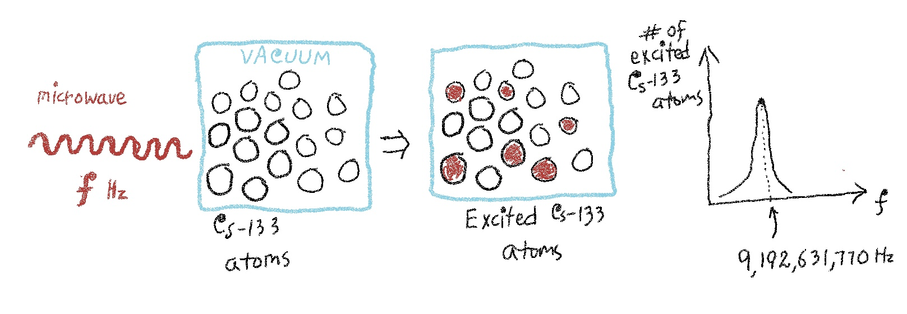

There are three fundamental units (of time, distance, and mass) and all other units of measurement are some combination of these three. First we define the unit of time--one second; we use _second_ to define the unit of distance--one meter; and we use both _second_ and _meter_ to define the unit of mass--one kilogram.

```{=html}
<link rel="stylesheet" href="https://tikzjax.com/v1/fonts.css">
<script defer src="https://tikzjax.com/v1/tikzjax.js"></script>

<div style="display:flex; justify-content:center; width:100%; margin-bottom:1.5rem;">
<script type="text/tikz">
\begin{tikzpicture}[scale=1.5,transform shape,
  every node/.style={draw,font=\small,inner sep=2pt},
  arrow/.style={->,>=latex,line width=.8pt}]

  \node (s) at (1.2,1.6) {1 second};
  \node (m) at (0,.8)    {1 meter};
  \node (k) at (1.4,0)   {1 kilogram};

  \draw[arrow] (m) -- (s);
  \draw[arrow] (k.north) -- (m);
  \draw[arrow] (k.north) -- (s.south);

\end{tikzpicture}
</script>
</div>
```

We want these units to be stable, universal, and reproducible. What that means is: ten seconds should mean exactly the same duration today and 1000 years from now, here and anywhere else, and anyone with the right equipment should be able to reproduce that ten-second duration independently. 

## Second
One second is the duration of exactly 9,192,631,770 cycles of microwave radiation resonant with the unperturbed ground-state hyperfine transition of a cesium-133 atom.

<details>
<summary>More...</summary>

```{=html}
<style>
.quarto-figure figcaption {
  text-align: center !important;
}
</style>
```



<details>
<summary><strong>Why exactly 9,192,631,770 cycles?</strong></summary>

To preserve the duration of the second already in use.

</details>

<details>
<summary><strong>Why cesium-133?</strong></summary>

Cesium-133 has a stable, reproducible resonance that scientists can measure precisely using microwave electronics.

</details>

<details>
<summary><strong>Why use a vacuum?</strong></summary>

A vacuum reduces collisions with surrounding gas, which could disturb the atoms and shift their resonance frequency.

</details>

</details>


## Meter
One meter is the distance light travels in a vacuum in exactly $\tfrac{1}{\text{299,792,458}}$ of a second.

<details>
<summary>More...</summary>
</details>


## Kilogram
One kilogram is the mass that makes Planck's constant $h$ exactly $6.62607015\times10^{-34}\ \mathrm{kg \cdot m^2/s}$

<details>
<summary>More...</summary>
</details>