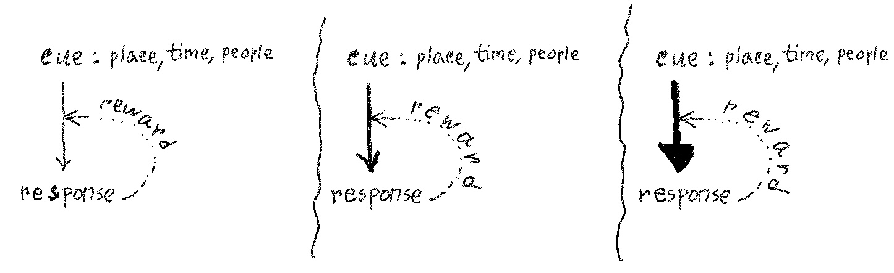

> Habits automate familiar routines, freeing attention and deliberate effort for tasks that need them.

A habit is a learned (cue, response) association built through repetition, often supported by immediate reward. Lowering friction makes repetition easier—reducing the “activation energy” to act. Once established, the cue can prompt a response with little mental effort, even when the original reward is no longer valued. Such routines can escape notice; tracking can reveal them and help us decide what to preserve or change.

```{=html}
<style>
.quarto-figure figcaption {
  text-align: center !important;
}
</style>
```



<!--

| Goal | Cue | Response | Friction | Reward | Period |
|---|---|---|---|---|---|
| Checking phn | About to make a purchase | Pay only with cash or skip the purchase | Carry no cards | Saving from skipping a purchase | 8 weeks |

-->

## Sources
* Good Habits, Bad Habits by Wendy Wood

<!--
* Tiny Habits by BJ Fogg
* [Habit measurement](https://pmc.ncbi.nlm.nih.gov/articles/PMC3552971/pdf/1479-5868-9-102.pdf)
-->

<!--
* [Goals and Habits in the Brain](https://www.gatsby.ucl.ac.uk/~dayan/papers/dolandayan2013.pdf)
* [Habits Without Values](https://kevinjmiller.org/wp-content/uploads/2019/01/millershenhavludvig_psychrev_inpress.pdf)
* [Rethinking Approach and Avoidance in Achievement Contexts:
The Perspective of Dynamical Systems](https://www.researchgate.net/publication/290818619_Rethinking_Approach_and_Avoidance_in_Achievement_Contexts_The_Perspective_of_Dynamical_Systems)
-->

* [Habit scorecard](https://jamesclear.com/habits-scorecard)

<!--
* [Sleep hygine](https://pmc.ncbi.nlm.nih.gov/articles/PMC9815428/pdf/RHPB_11_2162904.pdf)
* [Cue planning](https://discovery.ucl.ac.uk/id/eprint/10118622/1/Jan%20paper.pdf)
* [Smartphone checking 1](https://pmc.ncbi.nlm.nih.gov/articles/PMC9112639/pdf/11469_2022_Article_826.pdf)
* [Smartphone checking 2](https://pmc.ncbi.nlm.nih.gov/articles/PMC9974409/pdf/pnas.202213114.pdf)
* [Moving more](https://pmc.ncbi.nlm.nih.gov/articles/PMC11273430)
* [Unhealhty snacking](https://pubmed.ncbi.nlm.nih.gov/25099386/)
* [Flossing](https://pubmed.ncbi.nlm.nih.gov/22989272/)
* [Procrastination 1](https://www.researchprotocols.org/2013/2/e46)
* [Procrastination 2](https://www.sciencedirect.com/science/article/pii/S1041608016302187?via%3Dihub)
* [Procrastination 3](https://eprints.whiterose.ac.uk/id/eprint/91793/)
* [Relapse prevention](https://pmc.ncbi.nlm.nih.gov/articles/PMC3163190/pdf/1747-597X-6-17.pdf)
* [Mindfulness for smoking](https://pmc.ncbi.nlm.nih.gov/articles/PMC3619004/pdf/nihms430593.pdf)
* [Mindfulness for alcohol](https://pmc.ncbi.nlm.nih.gov/articles/PMC3619004/pdf/nihms430593.pdf)
* [Coping skills manual](https://www.niaaa.nih.gov/sites/default/files/match03.pdf)
* [Duration](https://www.flexyourbrain.com/wp-content/uploads/2015/10/UL-STUDY-66-Days-IJSP_998-1009.pdf)
-->